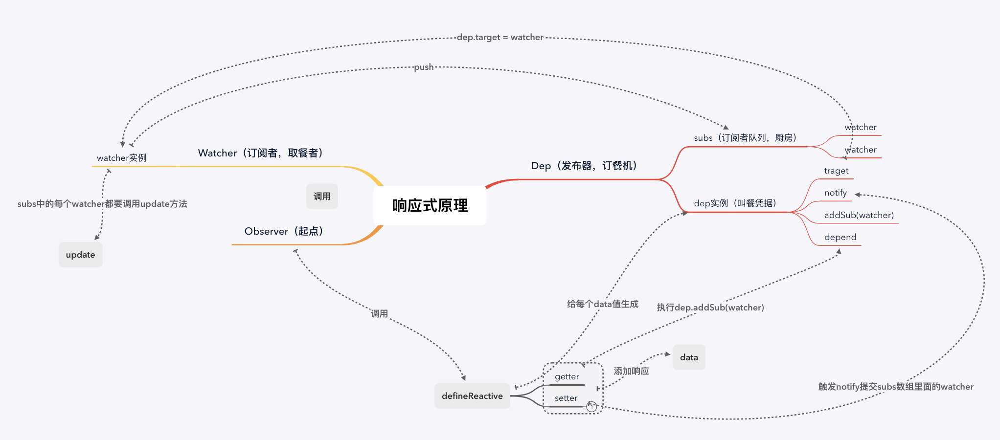

# Vue基础知识

## 1. Vue的通信机制有 props/emit、event Bus、vuex、provide/inject、$attrs/$listeners 五种

## 2. vue开始加载出现message字样，闪屏问题？在css里加上 [v-cloak] { display: none; } 。如果没有彻底解决问题，则在根元素加上 style="display: none;" :style="{display:  block }"

## 3. \$route和\$router的区别$router 是VueRouter的实例，在script标签中想要导航到不同的URL,使用 \$router.push 方法。返回上一个历史history用 \$router.to(-1)，\$route 为当前router跳转对象。里面可以获取当前路由的name,path,query,parmas等。


## 4. Vue2.x的默认diff算法是把所有的虚拟节点都过一遍，比对props,但是到了Vue3.x，diff算法改进，只比对追踪createVNode中有动态参数的节点，（会携带一个patch flag）意味着静态节点不比对了.更高优化，静态节点会在应用启动的时候脱离编译定义一次，然后后面再渲染的时候反复复用

## 5. vue3.x使用了tree-shaking(打包工具根据import来实现剔除无用模块)，在不使用v-model transition等等这些内置功能的时候 是不会被build进包里

```JavaScript
  <div></div>

  //编译后
    import { createVNode as _createVNode, openBlock as _openBlock, createBlock as _createBlock } from "vue"

    export function render(_ctx, _cache) {
      return (_openBlock(), _createBlock("div"))
    }
```

## 6. vue 3.x组件中不需要再用一个div包裹内容 哪怕是纯文字都能够渲染了

## 7. computed属性，从底层角度来说是一个懒计算属性，他是通过判断依赖属性的变化来进行计算，其中有一个this.dirty属性标记计算属性是否需要更新。当依赖的值变化但是没有在其他地方使用到计算属性的时候，this.dirty会变为true值不进行计算，当其他地方使用到了计算属性，依赖值发生变化才会重新计算。 所以这个是computed和watch属性的区别之一


## 8. nextTick原理。tick是vue执行的事件循环，nextTick是vue通过JS的异步队列方式来进行实现的，其中涉及到了宏任务和微任务，通过微任务的高优先级来实现nextTick回调函数的优先调用，也能保证队列中的
所有微任务在一次事件循环的过程中被执行完毕。考虑到兼容问题vue做了微任务和宏任务的降级方案，宏任务优先使用setImmediate 在 MessageChannel 最后使用setTimeout

## 9. 为甚vue组件中的data必须是一个函数。 因为vue的组件是可以复用的，对象里的data如果是一个对象的话，JS对象是引用类型所以会造成数据污染，使用函数就是创建封闭作用域防止污染。根vue组件可以写data对象 因为跟组件不会被复用

## 10. compilerToFunction：这个方法是用在$mount中，render 和 template都不存在的时候，提取el的html 节点来生成render函数的方法

compilerToFunction其实和compiler的作用一样，都是由createCompilerCreator函数生成的用来把模板编译成render function

```javascript
  const vue = new Vue({
    el: '#app',
    router,
    store,
    i18n,
    components: { App },
    template: '<App/>'
    render: (h) => h
  })

  createCompilerCreator(function baseCompile (
    template: string,
    options: CompilerOptions
  ): CompiledResult {
    const ast = parse(template.trim(), options)
    if (options.optimize !== false) {
      optimize(ast, options)
    }
    const code = generate(ast, options)
    return {
      ast,
      render: code.render,
      staticRenderFns: code.staticRenderFns
    }) {
    ...
    return {
      compile,
      compileToFunctions: createCompileToFunctionFn(compile)
    }
  }
```

## 11. complier函数其实也是把template生成的render function 的一个方法和compileToFunction方法功能一样，参考上面伪代码。
所以compiler的过程涉及到了是三个步骤

1. 将template通过parse（大量正则）方法转化为AST抽象语法树
2. 将AST用optimize方法进行静态优化
3. 用AST生成render function

## 12. 每个watcher是订阅者，dep是依赖管理者（类似于叫号机）负责纪录和通知订阅者，而数据就是发布者

## 13. Vue的响应机制，首先在init()方法执行后，会调用Observer()这个方法给*每个data*的值通过defineReactive（）进行数据响应化， const dep = new Dep()会生成一个Dep的实例对象（类似于叫号的叫号单），其中在defineProperty的getter中，每个数据Dep的实例对象的Dep.target都是指向Watcher(每个data都有一个Watcher实例对象,每个watcher对象对应每个dep管理者)。在getter方法中会调用dep.depend方法，其中就有执行dep.addSub(watcher)这一步，当watcher实例添加到dep的subs数组（订阅者队列）中也就成了收集依赖，按下保存键触发dep.notify()方法，首先对subs数组排序（还不清楚），再通过遍历依次触发subs数组中每个watcher的update方法（其中queueWatcher本质上也是watcher的run方法）然后在重新执行reander函数生成新的页面.

