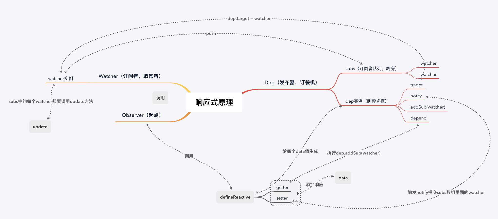

# Vue基础知识

## 1. Vue的通信机制有 props/emit、event Bus、vuex、provide/inject、$attrs/$listeners 五种 + 2.6.0  =》 Vue.Observable(obj) 类似EventBus

## 2. vue开始加载出现message字样，闪屏问题？在css里加上 [v-cloak] { display: none; } 。如果没有彻底解决问题，则在根元素加上 style="display: none;" :style="{display:  block }"

## 3. \$route和\$router的区别$router 是VueRouter的实例，在script标签中想要导航到不同的URL,使用 \$router.push 方法。返回上一个历史history用 \$router.to(-1)，\$route 为当前router跳转对象。里面可以获取当前路由的name,path,query,parmas等。


## 4. Vue2.x的默认diff算法是把所有的虚拟节点都过一遍，比对props,但是到了Vue3.x，diff算法改进，只比对追踪createVNode中有动态参数的节点，（会携带一个patch flag）意味着静态节点不比对了.更高优化，静态节点会在应用启动的时候脱离编译定义一次，然后后面再渲染的时候反复复用

## 5. vue3.x使用了tree-shaking(打包工具根据import来实现剔除无用模块)，在不使用v-model transition等等这些内置功能的时候 是不会被build进包里

```JavaScript
  <div></div>

  //编译后
    import { createVNode as _createVNode, openBlock as _openBlock, createBlock as _createBlock } from "vue"

    export function render(_ctx, _cache) {
      return (_openBlock(), _createBlock("div"))
    }
```

## 6. vue 3.x组件中不需要再用一个div包裹内容 哪怕是纯文字都能够渲染了

## 7. computed属性，从底层角度来说是一个懒计算属性，他是通过判断依赖属性的变化来进行计算，其中有一个this.dirty属性标记计算属性是否需要更新。当依赖的值变化但是没有在其他地方使用到计算属性的时候，this.dirty会变为true值不进行计算，当其他地方使用到了计算属性，依赖值发生变化才会重新计算。 所以这个是computed和watch属性的区别之一


## 8. nextTick原理。tick是vue执行的事件循环，nextTick是vue通过JS的异步队列方式来进行实现的，其中涉及到了宏任务和微任务，通过微任务的高优先级来实现nextTick回调函数的优先调用，也能保证队列中的
所有微任务在一次事件循环的过程中被执行完毕。考虑到兼容问题vue做了微任务和宏任务的降级方案，宏任务优先使用setImmediate 在 MessageChannel 最后使用setTimeout

## 9. 为甚vue组件中的data必须是一个函数。 因为vue的组件是可以复用的，对象里的data如果是一个对象的话，JS对象是引用类型所以会造成数据污染，使用函数就是创建封闭作用域防止污染。根vue组件可以写data对象 因为跟组件不会被复用

## 10. compilerToFunction：这个方法是用在$mount中，render 和 template都不存在的时候，提取el的html 节点来生成render函数的方法

compilerToFunction其实和compiler的作用一样，都是由createCompilerCreator函数生成的用来把模板编译成render function

```javascript
  const vue = new Vue({
    el: '#app',
    router,
    store,
    i18n,
    components: { App },
    template: '<App/>'
    render: (h) => h
  })

  createCompilerCreator(function baseCompile (
    template: string,
    options: CompilerOptions
  ): CompiledResult {
    const ast = parse(template.trim(), options)
    if (options.optimize !== false) {
      optimize(ast, options)
    }
    const code = generate(ast, options)
    return {
      ast,
      render: code.render,
      staticRenderFns: code.staticRenderFns
    }) {
    ...
    return {
      compile,
      compileToFunctions: createCompileToFunctionFn(compile)
    }
  }
```

## 11. complier函数其实也是把template生成的render function 的一个方法和compileToFunction方法功能一样，参考上面伪代码。
所以compiler的过程涉及到了是三个步骤

1. 将template通过parse（大量正则）方法转化为AST抽象语法树
2. 将AST用optimize方法进行静态优化
3. 用AST生成render function

## 12. 每个watcher是订阅者，dep是依赖管理者（类似于叫号机）负责纪录和通知订阅者，而数据就是发布者

## 13. Vue的响应机制，首先在init()方法执行后，会调用Observer()这个方法给*每个data*的值通过defineReactive（）进行数据响应化， const dep = new Dep()会生成一个Dep的实例对象（类似于叫号的叫号单），其中在defineProperty的getter中，每个数据Dep的实例对象的Dep.target都是指向Watcher(每个data都有一个Watcher实例对象,每个watcher对象对应每个dep管理者)。在getter方法中会调用dep.depend方法，其中就有执行dep.addSub(watcher)这一步，当watcher实例添加到dep的subs数组（订阅者队列）中也就成了收集依赖，按下保存键触发dep.notify()方法，首先对subs数组排序（还不清楚），再通过遍历依次触发subs数组中每个watcher的update方法（其中queueWatcher本质上也是watcher的run方法）然后在重新执行reander函数生成新的页面.



## 14. vue中key的作用与原理

作用： 
1. 是用来加快diff算法检索节点，和复用节点的一个标识，能提高虚拟DOM复用效率
2. 给一个非遍历的节点加上key值可以强制替换元素和更新虚拟dom,组件也一样

原理：有了key值在vnode方法生成虚拟节点的时候会把这个key当做vnode的唯一标识，在没有
key的情况下插入节点需要从头开始，有了key的话可以准确的找到需要插入节点的位置插入节点。
详细请参考diff算法

## 15. Vue.observable你有了解过吗？说说看

这是一个可以创建响应式数据的Vue全局API,功能类似于EventBus,可以使引入了Vue.observable({count: 1})创建属性的组件，对count的改变可以刷新组件的视图。

```html
  <body>
    <div id="root">
      {{message}}
      <button @click="change">Change</button>
    </div>
    <script>
      const state = Vue.observable({ message: 'Vue 2.6' })
      const mutation = {
        setMessage(value) {
          state.message = value
        }
      }
      new Vue({
        el: '#root',
        computed: {
          message() {
            return state.message
          }
        },
        methods: {
          change() {
            mutation.setMessage('Vue 3.0')
          }
        }
      })
    </script>
  </body>
```

## 16. 如何扩展某个现有组件

### 1. 使用Vue.extend直接扩展

Vue.extend()返回的是一个组件实例构造器，Vue.Component()是一个注册组件的全局方法
extend的作用倾向于给extend方法传递一些组件配置，然后生成一个组件构造器，new一下就能够使用
（因为组件可以有多个）

```javascript

var apple = Vue.extend({
  data() {
    return {}
  }
})

Vue.component('apple', apple)

//或者

new apple().$mount('body')

//或者

document.body.appendChild(apple.$el)  // 将组件挂载到body上

```

### 2. 使用Vue.mixin全局混入

mixin是一种分发Vue组件中可复用功能呢的非常灵活的方式，混入对象可以包含任意组件选项。当组件使用混入对象时，所有混入对象的选项将被混入该组件本身的选项。

当组件和混入对象含有同名选项时，这些选项将以恰当的方式混合。

```
1. 数据对象（data）在内部会进行递归合并，在和组件的数据发生冲突时以组件数据优先。
2. 同名钩子函数（created,mounted...）将混合为一个数组，因此都将被调用。另外，混入对象的钩子将在组件自身钩子之前调用。
3. 值为对象的选项（methods, components 和 directives）将被混合为同一个对象。两个对象键名冲突时，取组件对象的键值对。
```

```javascript
  let MIXIN = {
    data() {
        return {
            name: 'mixin'
        }
    },
    created() {
        console.log('mixin...', this.name);
    },
    mounted() {},
    methods: {}
  };
  export default MIXIN;

    //全局引用
  import mixin from './mixin'
  Vue.mixin(mixin)

  //在vue文件中引用
  import '@/mixin'; // 引入mixin文件
  export default {
    mixins: [mixin]
  }
```

### 3. HOC封装

高阶组件就是一个函数接受一个组件为参数，返回一个包装后的组件。
高阶组件，官方不对推荐

### 4. 加slot扩展


## 17. props数据传递原理

参考下列代码

```html
  <div>
    <Child :c_props="c_props"></child>
  <div>
  ...

  data() {
    return {
      c_props: 'parent'
    }
  }
```

1. vue在解析父组件的时候会使用with方法，保证作用域不变，使子组件的属性拿到具体的值，
并且当做子节点的属性attrs，如果传入的是引用类型数据，子组件修改会影响父组件。这是原样传入
```
  { attrs: { c_props: 'parent' } }
```
2. 子组件拿到了所有属性后，过滤出props,并且保存在_props中
3. 将props复制到vue的实例(vm)上(访问转接、赋值转接)，并且设置为响应式。所以_props中存在的值，this上也存在。
4. 当父组件的数据更新之后，会触发父组件的watcher,数据自上而下更新，引起子组件props的更新

## 18. prop是怎么做验证的？

props的的验证运用了校验器模式，简单来说，就是把函数开头对参数校验的这一部分单独提取出来当做校验器，然后参数传入校验器不对的话就抛出异常

## 19. Vue页面加载优化步骤

1. 把组件都改为异步引入组件，路由懒加载
2. 图片的手动和webpack压缩
3. 用npm run build --report查看哪些包比较大，用cdn版本然后使用externals映射全局变量
再引入
4. vue cli3 有prefetch插件，默认开启用来预先记载所有模块
用config.plugins.delete('prefetch')删除或者更改配置项
5. 组件重复打包，可以在webpack的config文件中，修改CommonsChunkPlugin（webpack4=>SplitChunksPlugin）的配置，
minChunk:2 把使用了两次的包抽出来放进公共依赖
6. 拆完包之后，我们再用gzip做一下压缩,安装compression-webpack-plugin
```javascript
  new CompressionPlugin({
    test: /\.js$|\.html$|\.css/, //匹配文件名
    threshold: 10240, //对超过10k的数据进行压缩
    deleteOriginalAssets: false //是否删除原文件
  }

  //在项目中使用
  const compression = require('compression')
  app.use(compression())

```

## 20. vue的数组方法有哪些，怎么实现监听的

vue的数组方法有pop、push、shift、unshift、sort、reverse、splice

Vue把在data属性中数组值的数组方法都重新封装了一遍

1. 首先先把数组的对应方法存在orginal中
2. 调用def方法 对数组方法进行重写
3. def方法传入三个参数，其中最后一个参数是重新封装数组方法的流程
4. 用原参数先执行原数组方法，如果有新增元素的数组方法要通过observerArray方法进行逐个值进行数据响应化
5. 最后再手动触发Dep.notify()方法进行watcher更新

## 21. vue $on、$emit实现原理

$emit:  this.\$emit(string, data)
1. $emit会把传入的事件名称字符串转为小写，然后再判断是否符合语法标准
2. 拿到转换后的事件名称之后，在事件列表（_events）中寻找对应的回调函数（$on注册的）
3. 如果没有找到就直接返回，找到了先进行一次判断，判断回调函数是否大于1，如果大于一就把他转为一个数组
4. 这时候第一个参数事件名已经不再需要了，$emit会将其舍弃，并把剩下的参数转换成数组。遍历调用一个带有try&catch的invokeWithErrorHandling()方法，并在其中使用apply()或call()来调用事件回调函数。

$on: 可以多个事件绑定同一个回调函数(数组) this.\$on(string/array, fn)
1. 对第一个参数做一个是否为数组的判断，这里可以看出$on允许为多个事件绑定同一个回调函数。
2. 如果参数为数组，那么它会使用for遍历这个数组，并进行递归。
3. 如果参数为字符串，那么它会在已有的事件(_events,供$emit调用)中寻找是否已经存在相同的事件，如果有就不处理vm.events[name],如果没有会创建并**初始化为空数组**同时将传递的第二个参数也就是事件被触发时需要执行的回调函数添加push进去。


## 22. computed和watch方法原理对比

computed方法其实是一个惰性求值的订阅者，他在对比新旧值的时候回去检查这个值相关的订阅数组，如果长度大于0代表有订阅者，值改变就更新
如果订阅数组中没有watcher，computed只会把this.dirty这个值设置为true，不进行相关计算，节约性能

$watch方法比较核心的就是会去把this.user设置为true，代表是用户自己创建的watcher（后面watcher的run方法会作判断 用来抛异常），还会去判断immediate参数，用来判断是否立即执行。
$watch()本质还是创建一个Watcher实例对象。返回的是watcher.teardown()解除当前观察者对属性的观察

vm.$watch 返回一个取消观察函数，用来停止触发回调：

var unwatch = vm.$watch('a', cb)
// 之后取消观察
unwatch()

以watch: {}方法和this.$watch方法写侦听器的区别

watch方法和$watch不会默认立即执行，只有配置了immediate属性才会，
watch方法会自己注销侦听器，但是$watch 需要手动注销侦听器
watch方法配置deep和immediate需要用到handler函数

## 23. patch函数过程


diff的过程就是调用名为patch的函数，比较新旧节点，一边比较一边给真实的DOM打补丁。

patch方法会优先判断新旧节点是否相同（有判断相同的方法sameVnode()）,如果不相同直接替换返回新的vnode了。如果发现新旧节点相同就开始后续比较

```javascript

  function patch (oldVnode, vnode) {
    // 此时vnode.el说的是真实的dom 在patch完之前他是空的
    if (sameVnode(oldVnode, vnode)) {
        patchVnode(oldVnode, vnode)
    } else {
        const oEl = oldVnode.el
        let parentEle = api.parentNode(oEl)
        createEle(vnode)  // 创建真实dom
        if (parentEle !== null) {
            api.insertBefore(parentEle, vnode.el, api.nextSibling(oEl))
            api.removeChild(parentEle, oldVnode.el)
            oldVnode = null
        }
    }
    return vnode
    //patch最后会返回vnode，vnode和进入patch之前的不同在哪？就是vnode.el，唯一的改变就是之前vnode.el = null, 而现在它引用的是对应的真实dom。

```

需要注意的是，el属性引用的是此 virtual dom对应的真实dom，patch的vnode参数的el最初是null，因为patch之前它还没有对应的真实dom。


下面看patchNode方法，用来对值得比较的新旧节点做处理（值得比较的意思是，key sel这些参数相同才值得，这个方法比较简单）


### 值得比较的节点有五种对比情况

首先分为3种

1. oldVnode === vnode 新老节点的引用一致，就直接不改变了
2. 文本节点的比较，如果文本节点不同，会调用setTextContent()方法去修改
3. 除了文本节点不同以外所有的情况

其次分为以下3种

1. oldCh && ch && oldCh !== ch 两个节点都有子节点，而且他们不一样，这样就会调用updateChildren方法来比较子节点，这个是diff算法的核心
2. 只有新节点有子节点，调用createEle(vnode)，**vnode.el已经引用了老的dom节点，**createEle函数会在老dom节点上添加子节点。
3. 新节点没有子节点，老节点有子节点，直接删除老节点。

```javascript
  updateEle(el, vnode, oldVnode)
  if (oldCh && ch && oldCh !== ch) {
      updateChildren(el, oldCh, ch)
  }else if (ch){
      createEle(vnode) //create el's children dom
  }else if (oldCh){
      api.removeChildren(el)
  }

```

## 24. diff 算法

diff算法的存在,是用来对比两个都有子节点的新旧节点（vnode, oldVnode）的不同，他只会进行同级比较，也是updateChildren（）方法的核心

首先diff算法会初始化出四个变量，分别是新旧节点头尾，oldStart、oldEnd、start、end,再把它们两两比较，一共有四中比较方式

他一共分为五步

1. 头头比较，匹配中了oldStart,start 索引加一往后移。没匹配中就下一步
2. 尾尾比较，匹配中了oldStart,start 索引减一往前移。没匹配中就下一步
3. 头尾比较，匹配中了旧头指针后移，新尾指针前移，未确认dom序列（还没有确定位置的dom节点序列）中的头移到尾，进入下一次循环。没匹配中就下一步
4. 尾头比较，匹配中了新头指针后移（即 oldEnd-- && start++），未确认dom序列中的尾移到头，进入下一次循环,没匹配中进入下一部
5. 若节点有key且在旧子节点数组中找到sameVnode（tag和key都一致），则将其dom移动到当前真实dom序列的头部，新头指针后移（即 newStartIdx++）；否则，vnode对应的dom（vnode[newStartIdx].elm）插入当前真实dom序列的头部，新头指针后移（即 newStartIdx++）。其实就是根据新旧节点的key和target来确定插入到未确认序列的头部来定位，此时还剩下未确认序列，

循环结束后还有两种情况

新的字节点数组（newCh）被遍历完（start > end）都删除；新的先遍历完了就把多的删除
新的字节点数组（oldCh）被遍历完（oldstart > oldend）。那就需要把多余的新dom（start -> end）都添加。老的先遍历完就把多的添加

## 25. vuex原理

vuex使用过Vue.use()方法的插件机制，调用vuex的install方法来装载vuex的。
而vuex的install方法使用的是vue.mixin方法 混入机制，混入了beforeCreate这个钩子，然后把store的相关方法关联到对应的组件实例上

Vuex的state状态是响应式，是借助vue的data是响应式，将state存入vue实例组件的data中；
Vuex的getters则是借助vue的计算属性computed实现数据实时监听。