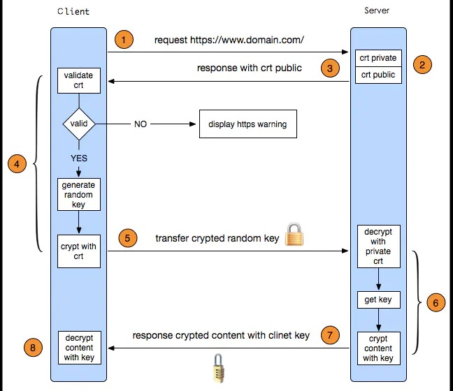

# https原理

## https介绍

http =  http + ssl
所以他们都是基于tcp/ip协议，是通过三次握手确定链接，再执行ssl证书验证传输信息

## https和http的区别

1. https需要到ca申请证书，免费较少，所以需要费用
2. http是超文本传输协议，信息是明文传输，https则是具有安全性的ssl加密传输协议
3. http和https使用的是完全不同的连接方式，用的端口也不一样，前者是80，后者是443
4. http的链接是很简单无状态的；https协议是由SSL+HTTP协议构建的可进行加密传输、身份认证的网络协议，比HTTP协议更安全

## https工作原理

1. 首先服务端拥有一套完整的公钥和私钥，这个公钥其实就是证书，客户端发起请求，服务端先发送公钥给客户端
2. 客户端拿到公钥后生成一个随机值key
3. 客户端把这个key用之前拿到的公钥进行加密发送给服务端
4. 服务端用私钥进行解密拿到key值，此时客户端服务端都有了同一个key,
5. 服务端用key使用对称加密方式对信息进行加密解密，就保证了数据的安全

tcp属于传输层，http https属于应用层

### https传输流程图

