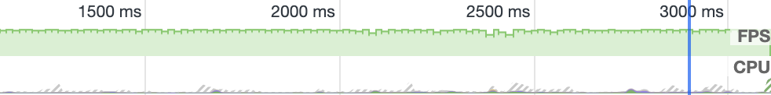
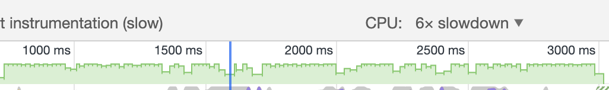
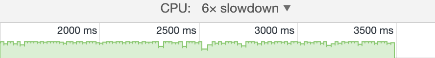

# 记一次平滑动画测试

如何使动画看起来更加的流畅，平滑？核心概念其实是帧数稳定在60帧左右。这次不讨论通过raf来实现平缓帧动画，讨论不依靠raf把现有的一些动画变得更加流畅，也就是平均帧数接近60帧。

## 1. 侧滑实验

本次实验最开始是一个左侧导航条飞入切换，使用left和transform来进行对比实验，现在行内普遍认为transform性能优于改变位置，因为可以减少页面重排。

相关属性代码

```css
  1.tansfrom: tanslateX(-100%);
    transition: transform 1s linear;

  and

  2.left: -100px;
    transition: left 1s linear;

```

由于页面结构不复杂以及动画非常简单，帧数基本都是60左右，但是如果加上will:change属性，或者transform: translateZ(0),也就是GPU引擎加速，可以极小的提升帧率的稳定，但是效果不太明显。所以得出结论：在基础简单的页面中，简单切换动画使用left或者transform改变dom位置对动画的连贯影响不大。


既然在简单页面看不出transform的优越性，那我们需要更复杂的页面和更加复杂的动画来继续测试

## 2. 复杂动画测试

这回我在平滑实验代码基础上进行了改动，在每个相关的盒子都添加了一些html结构，并且加上了margin,使他们能够增加页面容量，同时也对动画进行了改进，直接吧transition切换改成了animation动画。

### css

```css
  animation: test 0.2s linear alternate 10;

  @keyframes test {
    from {
        /* transform: translateX(-100%); */
        left: -600px;
    }
    to {
        /* transform: translateX(100%); */
        left: 600px;
    }
  }
```

### html

```html
  <div class="wrapper">
    <div class="page">
      <div class="header">哈哈哈哈哈哈哈
        <div style="margin:50px 0;"></div>
        
      </div>
      <div class="content">
        <p style="margin:50px 0;">哈哈哈哈哈哈哈</p>
        哈哈哈哈哈哈哈
        <div style="margin:50px 0;"></div>
      </div>
    </div>
    <div id="layer" class="layer"> //侧边盒子
      <div style="margin:50px 0;">哈哈哈哈哈哈哈</div>
      <div style="margin:50px 0;">哈哈哈哈哈哈哈</div>
      <div style="margin:50px 0;">哈哈哈哈哈哈哈</div>
    </div>
  </div>
```

这个就是动画的效果，我的目的就是让浏览器高负荷运作这样才能放大不同的属性之间极小的误差。


### 现在我们来看一下使用left的帧率是什么样子的，以下截图都是经过多次测试选出最能代表帧率的一张



可以看出有很多的锯齿状，这表示不太稳定,当我把GPU加速变成减6倍时，事情发生了，很多不规则的锯齿出现，整个动画变得不流畅了。




### 下面我们来试试transform如何

普通情况下和left是差不多的但是把GPU减六倍之后效果就有点不一样了,虽然帧率不太稳定但是相对于left实现，已经好很多了



## 总结

1. 在动画方面使用transform修改位置确实比left更好，每个方案测20次卡顿总的来说比left少很多
2. 实验中我给滑动属性添加了will-change:transform;有小幅提升
3. 实验有不完美之处，需要更复杂的动画来继续完善，并且需要更多数据
