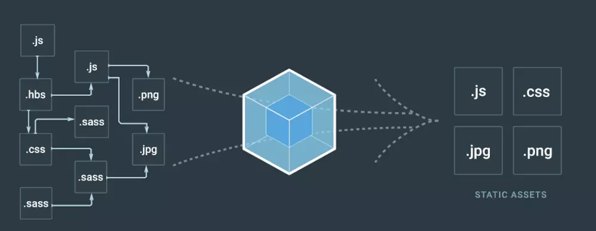
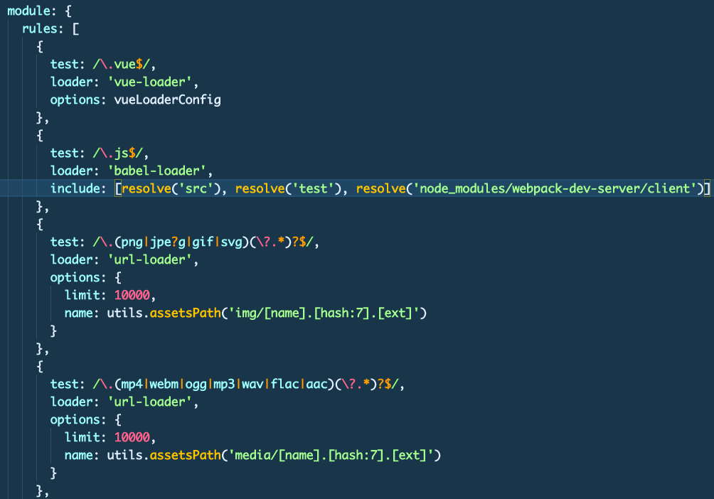

# webpack loader 学习

## 初识loader



这张图在熟悉不过了，webpack入门基本都看过它，webpack最主要的功能就是把蓝色菱形左边各式各样的模块全部打包成右边这几种统一规范的文件，而核心蓝色菱形就是loader。

举几个小例子：

1. vue 文件 需要用到*vue-loader*
2. es6 语法 需要使用*babel-loder*
3. sass 样式文件 需要用到*sass-loader*
4. ...

## loader是什么

1. 本质上来说loader是一个node模块
2. 是文件加载器，能够加载资源文件，并对这些文件进行一些处理，诸如编译、压缩等，最终一起打包到指定的文件中
3. loader支持链式调用，依次调用，同一种文件支持多个loader自下而上执行

## loader基本使用



这是一个webpack.base.confi.js的module配置，一些文件所需要的loader一般写在module.rules中。test定义的是正则匹配文件类型，**loader是定义编译此文件所需要的loader工具名**,options、include都是一些相关配置文件，这里不做赘述。

## 实现一个非常简单的loader

从零开始新建一个文件夹loader-study

npm init
webpack init
npm install

来创建一个简单的打包工具。
在webpack init过程中遇到加入css babel这样的loader的时候都可以选择否，我们实现的重点不在这块。

下面贴一下webpack.config.js的代码，都是些webpack基本配置，重点是module.rules里面的loader配置，我们这次要实现的是一个解析txt文件的loader，命名为self-loader.

```javascript
  const path = require('path');
  var HtmlWebpackPlugin = require('html-webpack-plugin')

  const UglifyJSPlugin = require('uglifyjs-webpack-plugin');

  module.exports = {
    entry: {
      app: './app.js'
    },
    output: {
      filename: 'result.js',
      path: path.resolve(__dirname, 'dist')
    },

    module: {
      rules: [ 
        { // 这个loader是我们自己实现的loader
          test: /\.txt$/,
          loader: 'self-loader'
        }
      ]
    },

    plugins: [new UglifyJSPlugin(), new HtmlWebpackPlugin({
      template: './index.html',
      filename: './output.html'
    })]
  };
```

接下来你需要在node_modules文件夹中创建一个self-loader 文件夹并在此文件夹下创建一个index.js。先上代码等下解释。

```javascript
  module.exports = function(source) {
    var str = source.split('').join('-')
    return `module.exports = '${str}'`
  }
```

在webpack中配置好了loader匹配规则，遇到txt文件都会进入这个loader方法，此方法的source参数会拿到txt文件中的所有内容，然后我们可以对这些内容进行处理之后返回。

为什么不直接返回，而是return `module.exports = ${source}` 
我想各位都知道，拿到返回内容使用得import，这里必须export。

然后我们再创建一个app.js文件,用来展示我们的loader成果

```javascript
  import hhh from'./test.txt'

  document.body.innerText = hhh
  console.log(hhh)
```

### 结果展示

test.txt 内容：  我是一个txt内容

页面输出：
我-是-一-个-t-x-t-内-容

package.json 配置

```json
  "dev": "webpack-dev-server --inline --progress --config webpack.config.js",
  "build": "webpack"
```

npm run build 可以在dist文件中看到打包出来的index.html文件中，loader对txt文件的处理效果。

## 部分疑问

1. 本文实现的loader作用仅仅局限于txt文件，那babel-loader、css-loader这些大概是怎么实现的？ 

答：简单来讲，比如babel-loader,他在拿到js文件后会把js代码 转换成一个抽象语法树，类似于json的一个结构，然后通过特定的编译规则把es6的一些语法替换成es5的语法来达到编译的效果。

2. loader中是否有更多的操作方法？

答： 是的loader中的source只是第一个参数，可以同在this.query获取在module.rules中配置的options参数。还有就是多个loader同步执行的时候使用this.callback(null,source,map,meta),可以更灵活的操作source,配置多个loader自下而上执行，在第一个loader中使用this.callback可以将参数传入第二个loader中。