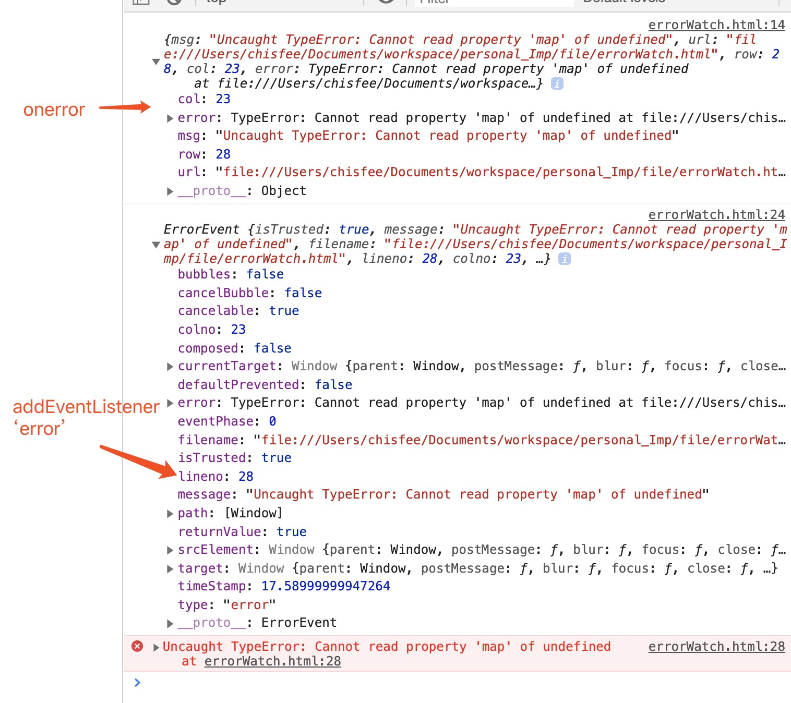

# 前端异常监测的几种方法

说到错误监测第一个想到的肯定 `try catch`,方便快捷，但是他无法监测到异步的错误，比如`setTimeout,setInterval,ajax` 等异步方法请求。

而且在实际工作中我们也不可能给所有的代码块都加上`try catch`来实现错误的实时监控

## 下面就介绍几种在不同环境框架下面的错误实时监控方法

### 1. Vue.js框架中的错误监控

```javascript
  Vue.config.errorHandler = function(err, vm, info) {
    // info是vue的特定错误信息，比如错误所在的生命周期钩子
    // 仅2.2.0以上支持此api
    console.log(info)
  }
```
```
从 2.2.0 起，这个钩子也会捕获组件生命周期钩子里的错误。同样的，当这个钩子是 undefined 时，被捕获的错误会通过 console.error 输出而避免应用崩溃。

从 2.4.0 起，这个钩子也会捕获 Vue 自定义事件处理函数内部的错误了。

从 2.6.0 起，这个钩子也会捕获 v-on DOM 监听器内部抛出的错误。另外，如果任何被覆盖的钩子或处理函数返回一个 Promise 链 (例如 async 函数)，则来自其 Promise 链的错误也会被处理。
```

### 2. 原生方法onerror 和 addEventListener全局错误监听

虽然两种方法都能监控到错误，但是相对来说addEventListener获取到的对象参数更多更丰富。


```javascript
  window.onerror = (msg, url, row, col, error) => {
      console.log({
          msg,
          url,
          row,
          col,
          error
      })
  }

  window.addEventListener('error', (e) => {
      console.log(e)
  })

  setTimeout(() => {
      undefined.map(val => {
          console.log(val)
      })
  }, 0)
```





**能捕获到资源加载的错误和未catch的promise的错误是addEventListener的特性之一**
需要注意的是在捕获资源错误的时候，这些错误时间不会向上冒泡到window,需要把addevnetListener这个的第三个参数设置会true才能捕获到。由于addEventListener也能够捕获js错误，因此需要过滤避免重复上报，判断为资源错误的时候才进行上报。

```javascript
    window.addEventListener('error', event => { 
      // 过滤js error
      let target = event.target || event.srcElement;
      let isElementTarget = target instanceof HTMLScriptElement || target instanceof HTMLLinkElement || target instanceof HTMLImageElement;
      if (!isElementTarget) return false;
      // 上报资源地址
      let url = target.src || target.href;
      console.log(url);
    }, true);
  })
```


```javascript
  // 捕获未 catch 的 promise 错误
  window.addEventListener("unhandledrejection", e => {
    e.preventDefault();
    console.log(e);
  });
  Promise.reject('promiseError');
```

### 3. 监控异步请求错误

#### axios

```javascript
// 请求拦截器
  axios.interceptors.request.use((config) => {
    // 发请求前做什么
    return config;
  }, (error) => {
    // 对请求错误做的
    return Promise.reject(error);
  });
// 响应拦截器
  axios.interceptors.response.use((response) => {
    // 所有接口响应做的
    return response;
  }, function(error) => {
    // 对响应错误做什么
    return Promise.reject(error)
  })
```

#### XMLHttpRequest

```javascript
  const AJAX = {
    // 记录请求的 url
    reqUrl: '',
    // 记录请求的方法
    reqMethod: '',
    // 保存原生的 open 方法
    xhrOpen: window.XMLHttpRequest.prototype.open,
    // 保存原生的 send 方法
    xhrSend: window.XMLHttpRequest.prototype.send,
    init() {
      const that = this;

      window.XMLHttpRequest.prototype.open = function () {
        that.reqUrl = arguments[1];
        that.reqMethod = arguments[0];
        that.xhrOpen.apply(this, arguments);
      };

      window.XMLHttpRequest.prototype.send = function () {
        this.addEventListener('readystatechange', function () {
          if (this.readyState === 4) {
            if (!this.status || this.status >= 400) {
              // 错误收集
            }
          }
        });

        that.xhrSend.apply(this, arguments);
      };
    },
  };
  AJAX.init()
```

#### fetch

```javascript
  const FETCH = {
    backup: window.fetch,
    init() {
      window.fetch = function (url, conf) {
        return (
          FETCH.backup.apply(this, arguments)
            .then((res) => {
              if (!res.status || res.status >= 400) {
                // 错误收集 
              }
              return res;
            })
        );
      };
    },
  };
  FETCH.init();
```