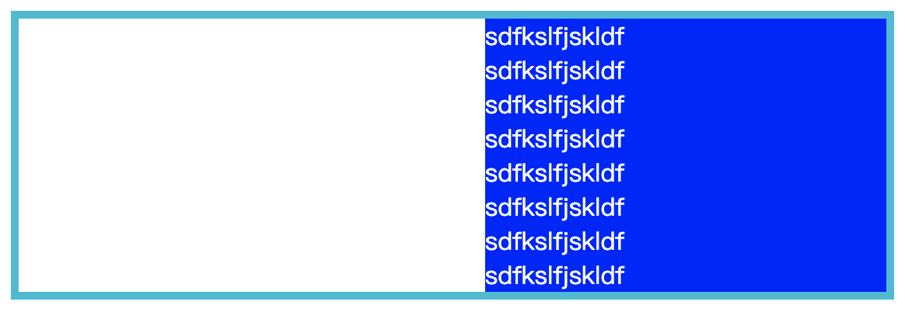
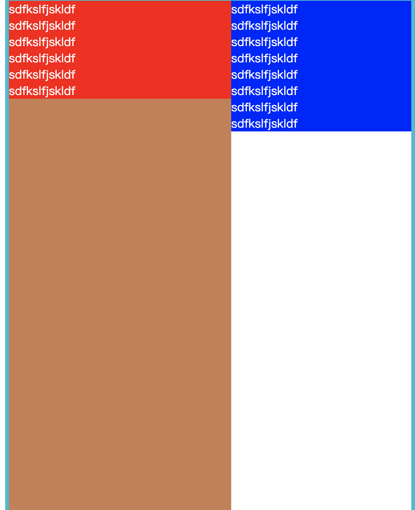

# 二列或者多列布局，其他列高度随一列高度自适应

标题有点拗口，简单来讲举个例子：

将页面分为.left盒子和.right盒子，他们的父节点都是.main，我想实现.right的盒子在内容增多的情况下高度不断变化，此时.left盒子的高度也要随之自动变化。

首先，我们知道一个盒子要具有高度无非有两种办法，第一用内容撑大盒子使盒子具有高度，内容消失盒子内容没有；第二就是给盒子定义一个高度，不随内容的增减而改变。现在我们要实现前文说的效果，定高肯定是不可以的，因为我们知道left 和 right盒子都是main盒子的子元素，任何一个元素内容增加会随之撑大main盒子,带着这个思路继续。

**ps: main的内容不会因为浮动子元素padding撑大了left而增大.left盒子padding的高度，需要在main上面加上overflow：hidden；清除浮动，left的padding才会撑大main**

我给right插入10行内容，left不加内容，得到的效果就是这样，左边的高度不会随着右边高度增加而增加，哪怕你在left上写height:100%;也不会得到高度，因为他只会继承父元素的height属性高度，而父元素main是被内容撑大的不具备height属性。



所以问题来了，既然我们不能通过写死高度来适配高度也不能通过继承高度来得到高度，那我们就得自力更生靠内容来撑大了，怎样撑大？用padding属性,padding的值是直接和内容宽高相关。

所以怎么做才能使padding像内容那样能随着父元素的高度增大而增大？

我这里用的是在需要自适应高度的盒子left,给padding设置一个极值，使left的内容变得特别大



这样明显不行，这已经影响了main的外部布局，所以涉及到外部布局需要用到margin属性，**超过了多少就要用margin的负值收多少**，

所以我们最后得到了三个盒子的样式,浮动和inline-block都可以

```css
  .main {
      border: 5px solid #00BCD4;
      overflow: hidden
  }
  
  .left {
      float: left;
      width: 300px;
      height: auto;
      background-color: red;
      color: #fff;
      padding-bottom: 9999px;
      margin-bottom: -9999px;
  }
  
  .right {
      margin-left: 300px;
      height: auto;
      color: #fff;
      background-color: blue;
  }
```

多列也是同样的道理，只需要在需要自适应高度的盒子加上padding极值在用margin负值就能得到一个自适应高的盒子，别忘了父节点一定要加overflow:hidden；要不然会看到很长的内容，padding也撑不大父元素。

缺点： 这种是设置padding极值的做法，如果说内容太长超过了极值会出现高度不够的问题
