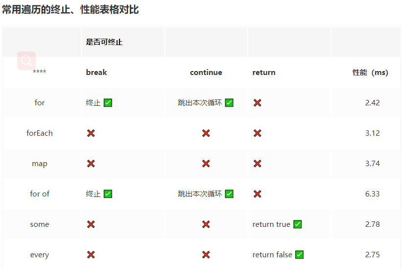

# 所有遍历简介

## 数组遍历

### for、forEach、for...of

```javascript
  const list = [1, 2, 3, 4, 5, 6, 7, 8,, 10, 11];

  for (let i = 0, len = list.length; i < len; i++) {
    if (list[i] === 5) {
      break; // 1 2 3 4
      // continue; // 1 2 3 4 6 7 8 undefined 10 11
    }
    console.log(list[i]);
  }

  for (const item of list) {
    if (item === 5) {
      break; // 1 2 3 4
      // continue; // 1 2 3 4 6 7 8 undefined 10 11
    }
    console.log(item);
  }

  list.forEach((item, index, arr) => {
    if (item === 5) return;
    console.log(index); // 0 1 2 3 5 6 7 9 10
    console.log(item); // 1 2 3 4 6 7 8 9 10
  });

```

小结

1. 三者都是基本的由左到右遍历数组
2. forEach无法跳出循环；for和for...of可以使用break或continue跳过或者中断
3. for...of直接访问的是实际元素。for遍历数组索引，forEach回调函数参数更丰富，元素、索引、原数组都可以获取
4. for...of与for如果数组中存在空元素，同样会执行

### some、every

```javascript
  const list = [
    { name: '头部导航', backward: false },
    { name: '轮播', backward: true },
    { name: '页脚', backward: false },
  ];
  const someBackward = list.some(item => item.backward);
  // someBackward: true
  const everyNewest = list.every(item => !item.backward);
  // everyNewest: false

```

小结

1. 二者都是用来做数组条件判断，都是返回一个布尔值
2. 二者都可以被中断执行
3. some是所有元素中有一个满足就立刻中断返回true，没有就返回false
4. every是所有元素都为目标条件，才返回true，如果有一个元素不满足就中断循环返回false

### filter、map

```javascript
  const list = [
    { name: '头部导航', type: 'nav', id: 1 },,
    { name: '轮播', type: 'content', id: 2 },
    { name: '页脚', type: 'nav', id: 3 },
    ];
    const resultList = list.filter(item => {
      console.log(item);
      return item.type === 'nav';
    });
    // resultList: [
    //   { name: '头部导航', type: 'nav', id: 1 },
    //   { name: '页脚', type: 'nav', id: 3 },
    // ]

    const newList = list.map(item => {
      console.log(item);
      return item.id;
    });
    // newList: [1, empty, 2, 3]

    // list: [
    //   { name: '头部导航', type: 'nav', id: 1 },
    //   empty,
    //   { name: '轮播', type: 'content', id: 2 },
    //   { name: '页脚', type: 'nav', id: 3 },
    // ]

```

小结

1. 都生成一个新数组，如果不操作遍历对象便不会修改原数组
2. 二者都会跳过空元素，这里和for和for of不同
3. map会将回调函数的返回值生成一个新的数组，长度和原数组一致，生成新数组的元素可以自己定义
4. filter会将符合条件的元素生成一个新数组，数组长度和原数组长度不一定相同，回调函数是返回过滤条件布尔值，生成的元素不能自定义，与对应元数组一致。

### find、findIndex

```javascript
  const list = [
    { name: '头部导航', id: 1 },
    { name: '轮播', id: 2 },
    { name: '页脚', id: 3 },
    ];
    const result = list.find((item) => item.id === 3);
    // result: { name: '页脚', id: 3 }
    result.name = '底部导航';
    // list: [
    //   { name: '头部导航', id: 1 },
    //   { name: '轮播', id: 2 },
    //   { name: '底部导航', id: 3 },
    // ]

    const index = list.findIndex((item) => item.id === 3);
    // index: 2
    list[index].name // '底部导航';

```

小结

1. 二者都是用来查找数组元素
2. find方法返回数组中满足callback函数的第一个元素的值，如果不存在返回undefined
3. findindex他返回数组中找到的元素索引，而不是值，如果不存在就返回-1

### reduce、reduceRight

reduce方法接受两个参数，第一个参数是回调函数（callback），第二个参数是初始值（initialValue）。

reduceRight方法出了与reduce执行方向相反外（从右到左），其他完全一致。

回调函数接收四个参数：

1. accumulator(累加器): MDN 上解释为累计器，但我觉得不恰当，按我的理解它应该是截至当前元素，之前所有的数组元素被回调函数处理累计的结果。
2. current: 当前被执行的数组元素
3. currentIndex：当前被执行的数组元素索引
4. sourceArray：原数组，也就是调用reduce方法的数组

**如果不传入初始值，reduce 方法会从索引 1 开始执行回调函数（默认加上第一个元素），如果传入初始值，将从索引 0 开始、并从初始值的基础上累计执行回调。**

reduce 三种用法

#### 计算对象数组某一属性的总和

```javascript
  const list  = [
    { name: 'left', width: 20 },
    { name: 'center', width: 70 },
    { name: 'right', width: 10 },
  ];
  const total = list.reduce((currentTotal, item) => {
    return currentTotal + item.width;
  }, 0);
  // total: 100

```

#### 对象数组的去重，并统计每一项重复次数

```javascript
  const list  = [
    { name: 'left', width: 20 },
    { name: 'right', width: 10 },
    { name: 'center', width: 70 },
    { name: 'right', width: 10 },
    { name: 'left', width: 20 },
    { name: 'right', width: 10 },
  ];
  const repeatTime = {};
  const result = list.reduce((array, item) => {
    if (repeatTime[item.name]) {
      repeatTime[item.name]++;
      return array;
    }
    repeatTime[item.name] = 1;
    return [...array, item];
  }, []);
  // repeatTime: { left: 2, right: 3, center: 1 }
  // result: [
  //   { name: 'left', width: 20 },
  //   { name: 'right', width: 10 },
  //   { name: 'center', width: 70 },
  // ]

```

#### 对象数组最大/最小值获取

```javascript
  const list  = [
    { name: 'left', width: 20 },
    { name: 'right', width: 30 },
    { name: 'center', width: 70 },
    { name: 'top', width: 40 },
    { name: 'bottom', width: 20 },
  ];
  const max = list.reduce((curItem, item) => {
    return curItem.width >= item.width ? curItem : item;
  });
  const min = list.reduce((curItem, item) => {
    return curItem.width <= item.width ? curItem : item;
  });
  // max: { name: "center", width: 70 }
  // min: { name: "left", width: 20 }

```

[reduce 其他用法](https://juejin.cn/post/6844904063729926152)

### 各个循环遍历时间统计

