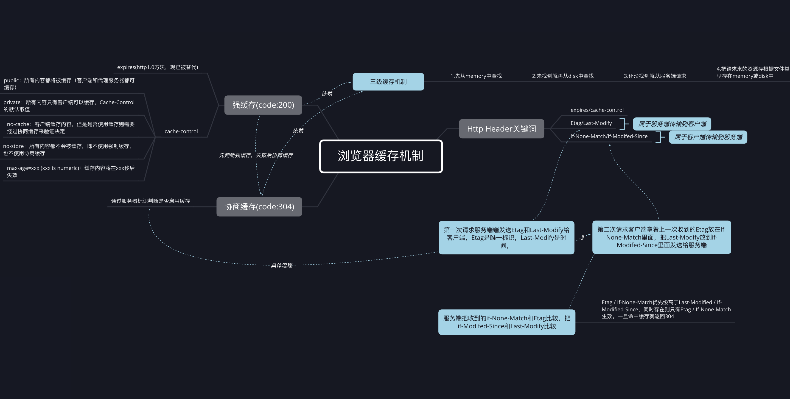

# 浏览器缓存机制

全文围绕下图展开

浏览器的缓存机制也就是我们说的HTTP缓存机制，其机制是根据HTTP报文的缓存标识进行的，无非就是请求头和响应头的报文。

要了解浏览器缓存机制我们得先介绍几个概念

1. 三级缓存机制，这个是一个计算机通用的概念，简单来说就是缓存分成了三个层级一次检查读取，在浏览器端分为了memory（浏览器自身缓存），disk(计算机磁盘)、服务端请求。通过这三级最终都能获取到资源，如果是从服务端请求了资源最后还需要把他存入到memory或者disk中。
2. HTTP请求和响应头，这其实就是在客户端和服务端交互过程中传递信息的一种报文，这里面包含了很多信息包括我们熟知的状态码code
3. cache-control/Expires, 控制强制缓存的字段，其中Cache-Conctrol的优先级比Expires高。现在常用的是cache-control,Expires由于还是http1.0**缺点是使用客户端的时间与服务端返回的时间做对比，遇到客户端和服务端时差就会出现不必要的麻烦**，所以这边就不做讨论，通过给cache-control传递不同的参数来控制来控制**是否缓存**、**缓存多久**、**客户端还是服务端缓存**
4. Etag/Last-Modify,这两个东西都是由服务端传输给客户端的东西，是HTTP响应头的专属字段，**Etag是服务端给资源的一个唯一标识**，**Last-Modify是一个服务端设置的最后修改时间，也是用来判断资源是否更新**
5. If-None-Match/If-Modified-Since,这两个东西都是请求的专属字段，是通过拿到上一次请求的Etag和Last-Modify来给他们分别赋值，再发送到服务端进行对比

## 下面我们按照浏览器读取资源顺序来讲一下浏览器缓存机制

### 第一次请求及响应

首次访问，客户端向服务端发起请求，服务端收到请求，在响应的头部带上Etag和Last-Modify字段，给这次资源增加了一个唯一表示（Etag）,和Last-Modify(最后修改时间).cache-control未生效，设置max-age=300

### 第二次请求

再次请求相同的资源，这时候客户端在请求头的头部加上了If-None-Match,上一次的请求Etag的值；以及IF-Modifed-Since，上一次请求Last-Modify的值；这两个值会发送服务端进行比对。

#### 场景1 服务端过程

这次响应cache-control设置的max-age5分钟，再次请求在这个时间之内,命中了强缓存，然后通过三级缓存机制获取资源返回200状态码，**强缓存返回的是200状态码，但是在状态码后面会跟上form Momory/ form disk**

#### 场景2 服务端过程

这次响应cache-control设置的max-age5分钟，再次请求已经超过了这个时间，所以强缓存没命中，进行协商缓存判断。服务端把从if-none-match中收到的上一次Etag的值和最新的Etag进行比对，如果命中就返回304，没命中就继续把if-modifed-since中上次Last-modify的值和这次Last-modify的值进行比对，如果命中就返回304，如果都没命中就发送最新资源，并把最新的Etag和Last-modify放在响应头传输给客户端.**命中协商缓存的304请求中Etag===If-none-match,Last-Modify === If-Modified-Since**

### 第二次响应

收到304状态码或者收到最新的Etag/Last-Modify响应头